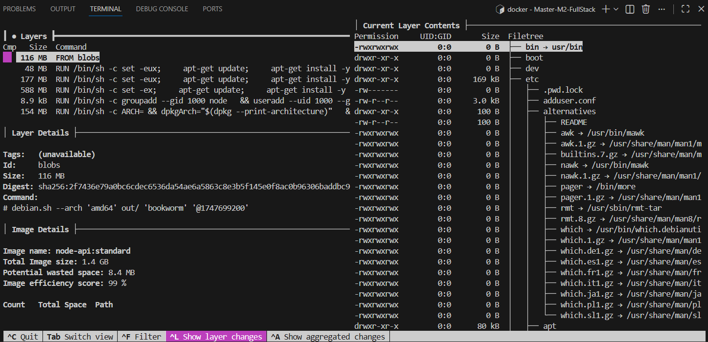
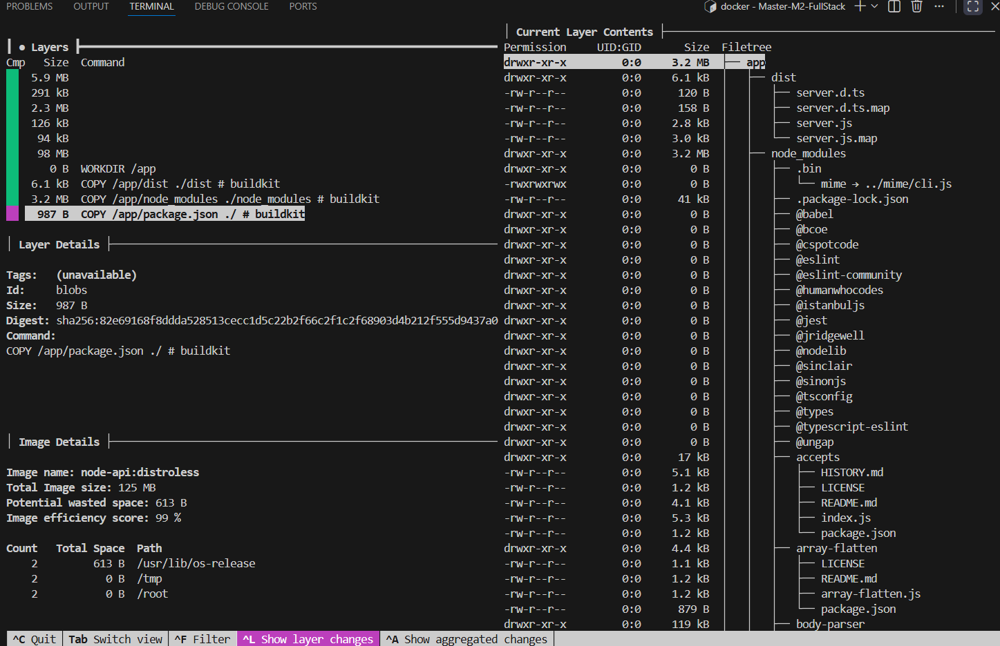

Template d'analyse - TP Docker Avancé
**Nom :** MOSLEH Nassim  
**Date :** [Date]  
**Groupe :** Dev WEB

---
Résumé exécutif

Objectifs atteints
- [ ] Réduction de taille des images > 80%
- [ ] Implémentation d'images distroless
- [ ] Scan de sécurité réalisé
- [ ] Calcul d'impact Green IT

Gains principaux
- **Taille totale économisée :** [X] GB
- **Réduction moyenne :** [X]%
- **Vulnérabilités éliminées :** [X]

---

Partie 1 - API Node.js

1.1 Analyse comparative des tailles

| Version | Taille | Réduction | Temps de build |
|---------|--------|-----------|----------------|
| Standard | [1380] MB | - | [27] secondes |
| Multi-stage | [262] MB | [67]% | [54] secondes |
| Distroless | [125] MB | [91%]% | [73] secondes |

1.2 Analyse des vulnérabilités

| Version | Critical | High | Medium | Low | Total |
|---------|----------|------|--------|-----|-------|
| Standard | [0] | [2] | [0] | [1] | [3] |
| Multi-stage | [X] | [X] | [7] | [5] | [12] |
| Distroless | [X] | [X] | [X] | [12] | [12] |

1.3 Analyse des layers avec dive

**Screenshot de l'analyse dive pour l'image standard :**
```

```

**Screenshot de l'analyse dive pour l'image distroless :**
```

```

1.4 Observations techniques

**Problèmes rencontrés :**
L'image standard inclut une distribution Linux complète (Debian), ce qui augmente la taille à 1.4GB et le temps de transfert réseau.

Le dossier node_modules contient souvent des fichiers de développement inutiles en production.

Erreur npm ci rencontrée lors du build multi-stage car le package-lock.json était manquant.

**Solutions appliquées :**
Multi-stage building : Séparation de l'étape de construction (avec les outils de compilation) et de l'étape d'exécution.

Images Distroless : Utilisation de gcr.io/distroless/nodejs pour supprimer le système d'exploitation (pas de shell, pas de gestionnaire de paquets), ne gardant que le runtime Node.js.

**Points d'amélioration :**
- [Décrire les améliorations possibles]

---
Partie 2 - API Python FastAPI

2.1 Analyse de l'image distroless

| Métrique | Valeur |
|----------|--------|
| Taille finale | [173] MB |
| Temps de build | [1m44] min |
| Vulnérabilités | [63] |
| Layers | [51] |

2.2 Test de l'application

**Tests réalisés :**
```bash
# Commandes de test
curl http://localhost:8000/health
curl http://localhost:8000/docs
```

**Résultats :**
- [ ] Application démarre correctement
- [ ] Endpoints fonctionnels
- [ ] Swagger UI accessible
- [ ] Aucun shell disponible (sécurité)

2.3 Analyse avec trivy

**Résultat du scan de sécurité :**
```
Nass@Nassim:~/Mastère2/DevWebFullStack/DevDockerBenhamdi/Master-M2-FullStack$ docker run --rm -v /var/run/docker.sock:/var/run/docker.sock aquasec/trivy image python-api:distroless
2025-12-09T09:00:33Z    INFO    [vulndb] Need to update DB
2025-12-09T09:00:33Z    INFO    [vulndb] Downloading vulnerability DB...
2025-12-09T09:00:33Z    INFO    [vulndb] Downloading artifact...        repo="mirror.gcr.io/aquasec/trivy-db:2"
1.64 MiB / 77.27 MiB [->_____________________________________________________________] 2.12% ? p/s ?5.50 MiB / 77.27 MiB [---->__________________________________________________________] 7.12% ? p/s ?8.81 MiB / 77.27 MiB [------->______________________________________________________] 11.40% ? p/s ?12.45 MiB / 77.27 MiB [------->________________________________________] 16.12% 18.04 MiB p/s ETA 3s16.28 MiB / 77.27 MiB [---------->_____________________________________] 21.07% 18.04 MiB p/s ETA 3s19.98 MiB / 77.27 MiB [------------>___________________________________] 25.86% 18.04 MiB p/s ETA 3s23.00 MiB / 77.27 MiB [-------------->_________________________________] 29.77% 18.01 MiB p/s ETA 3s24.75 MiB / 77.27 MiB [--------------->________________________________] 32.03% 18.01 MiB p/s ETA 2s26.53 MiB / 77.27 MiB [---------------->_______________________________] 34.34% 18.01 MiB p/s ETA 2s29.00 MiB / 77.27 MiB [------------------>_____________________________] 37.53% 17.50 MiB p/s ETA 2s32.58 MiB / 77.27 MiB [-------------------->___________________________] 42.16% 17.50 MiB p/s ETA 2s36.27 MiB / 77.27 MiB [---------------------->_________________________] 46.93% 17.50 MiB p/s ETA 2s39.75 MiB / 77.27 MiB [------------------------>_______________________] 51.44% 17.52 MiB p/s ETA 2s42.87 MiB / 77.27 MiB [-------------------------->_____________________] 55.49% 17.52 MiB p/s ETA 1s47.62 MiB / 77.27 MiB [----------------------------->__________________] 61.63% 17.52 MiB p/s ETA 1s51.67 MiB / 77.27 MiB [-------------------------------->_______________] 66.87% 17.67 MiB p/s ETA 1s55.45 MiB / 77.27 MiB [---------------------------------->_____________] 71.77% 17.67 MiB p/s ETA 1s59.33 MiB / 77.27 MiB [------------------------------------>___________] 76.78% 17.67 MiB p/s ETA 1s61.72 MiB / 77.27 MiB [-------------------------------------->_________] 79.87% 17.61 MiB p/s ETA 0s65.14 MiB / 77.27 MiB [---------------------------------------->_______] 84.30% 17.61 MiB p/s ETA 0s69.30 MiB / 77.27 MiB [------------------------------------------->____] 89.68% 17.61 MiB p/s ETA 0s73.03 MiB / 77.27 MiB [--------------------------------------------->__] 94.52% 17.70 MiB p/s ETA 0s77.27 MiB / 77.27 MiB [---------------------------------------------->] 100.00% 17.70 MiB p/s ETA 0s77.27 MiB / 77.27 MiB [---------------------------------------------->] 100.00% 17.70 MiB p/s ETA 0s77.27 MiB / 77.27 MiB [---------------------------------------------->] 100.00% 17.01 MiB p/s ETA 0s77.27 MiB / 77.27 MiB [---------------------------------------------->] 100.00% 17.01 MiB p/s ETA 0s77.27 MiB / 77.27 MiB [---------------------------------------------->] 100.00% 17.01 MiB p/s ETA 0s77.27 MiB / 77.27 MiB [---------------------------------------------->] 100.00% 15.91 MiB p/s ETA 0s77.27 MiB / 77.27 MiB [---------------------------------------------->] 100.00% 15.91 MiB p/s ETA 0s77.27 MiB / 77.27 MiB [---------------------------------------------->] 100.00% 15.91 MiB p/s ETA 0s77.27 MiB / 77.27 MiB [---------------------------------------------->] 100.00% 14.89 MiB p/s ETA 0s77.27 MiB / 77.27 MiB [---------------------------------------------->] 100.00% 14.89 MiB p/s ETA 0s77.27 MiB / 77.27 MiB [---------------------------------------------->] 100.00% 14.89 MiB p/s ETA 0s77.27 MiB / 77.27 MiB [---------------------------------------------->] 100.00% 13.92 MiB p/s ETA 0s77.27 MiB / 77.27 MiB [---------------------------------------------->] 100.00% 13.92 MiB p/s ETA 0s77.27 MiB / 77.27 MiB [---------------------------------------------->] 100.00% 13.92 MiB p/s ETA 0s77.27 MiB / 77.27 MiB [---------------------------------------------->] 100.00% 13.03 MiB p/s ETA 0s77.27 MiB / 77.27 MiB [---------------------------------------------->] 100.00% 13.03 MiB p/s ETA 0s77.27 MiB / 77.27 MiB [-------------------------------------------------] 100.00% 10.43 MiB p/s 7.6s2025-12-09T09:00:42Z     INFO    [vulndb] Artifact successfully downloaded       repo="mirror.gcr.io/aquasec/trivy-db:2"
2025-12-09T09:00:42Z    INFO    [vuln] Vulnerability scanning is enabled
2025-12-09T09:00:42Z    INFO    [secret] Secret scanning is enabled
2025-12-09T09:00:42Z    INFO    [secret] If your scanning is slow, please try '--scanners vuln' to disable secret scanning
2025-12-09T09:00:42Z    INFO    [secret] Please see https://trivy.dev/v0.67/docs/scanner/secret#recommendation for faster secret detection
2025-12-09T09:00:47Z    INFO    [python] Licenses acquired from one or more METADATA files may be subject to additional terms. Use `--debug` flag to see all affected packages.
2025-12-09T09:00:47Z    INFO    Detected OS     family="debian" version="12.12"
2025-12-09T09:00:47Z    INFO    [debian] Detecting vulnerabilities...   os_version="12" pkg_num=34
2025-12-09T09:00:47Z    INFO    Number of language-specific files       num=1
2025-12-09T09:00:47Z    INFO    [python-pkg] Detecting vulnerabilities...
2025-12-09T09:00:47Z    WARN    Using severities from other vendors for some vulnerabilities. Read https://trivy.dev/v0.67/docs/scanner/vulnerability#severity-selection for details.
2025-12-09T09:00:47Z    INFO    Table result includes only package filenames. Use '--format json' option to get the full path to the package file.

Report Summary

┌──────────────────────────────────────────────────────────────────────────────────┬────────────┬─────────────────┬─────────┐
│                                      Target                                      │    Type    │ Vulnerabilities │ Secrets │
├──────────────────────────────────────────────────────────────────────────────────┼────────────┼─────────────────┼─────────┤
│ python-api:distroless (debian 12.12)                                             │   debian   │       63        │    -    │
├──────────────────────────────────────────────────────────────────────────────────┼────────────┼─────────────────┼─────────┤
│ opt/venv/lib/python3.11/site-packages/annotated_types-0.7.0.dist-info/METADATA   │ python-pkg │        0        │    -    │
├──────────────────────────────────────────────────────────────────────────────────┼────────────┼─────────────────┼─────────┤
│ opt/venv/lib/python3.11/site-packages/anyio-4.12.0.dist-info/METADATA            │ python-pkg │        0        │    -    │
├──────────────────────────────────────────────────────────────────────────────────┼────────────┼─────────────────┼─────────┤
│ opt/venv/lib/python3.11/site-packages/bcrypt-5.0.0.dist-info/METADATA            │ python-pkg │        0        │    -    │
├──────────────────────────────────────────────────────────────────────────────────┼────────────┼─────────────────┼─────────┤
│ opt/venv/lib/python3.11/site-packages/cffi-2.0.0.dist-info/METADATA              │ python-pkg │        0        │    -    │
├──────────────────────────────────────────────────────────────────────────────────┼────────────┼─────────────────┼─────────┤
│ opt/venv/lib/python3.11/site-packages/click-8.3.1.dist-info/METADATA             │ python-pkg │        0        │    -    │
├──────────────────────────────────────────────────────────────────────────────────┼────────────┼─────────────────┼─────────┤
│ opt/venv/lib/python3.11/site-packages/cryptography-46.0.3.dist-info/METADATA     │ python-pkg │        0        │    -    │
├──────────────────────────────────────────────────────────────────────────────────┼────────────┼─────────────────┼─────────┤
│ opt/venv/lib/python3.11/site-packages/ecdsa-0.19.1.dist-info/METADATA            │ python-pkg │        1        │    -    │
├──────────────────────────────────────────────────────────────────────────────────┼────────────┼─────────────────┼─────────┤
│ opt/venv/lib/python3.11/site-packages/fastapi-0.118.3.dist-info/METADATA         │ python-pkg │        0        │    -    │
├──────────────────────────────────────────────────────────────────────────────────┼────────────┼─────────────────┼─────────┤
│ opt/venv/lib/python3.11/site-packages/greenlet-3.3.0.dist-info/METADATA          │ python-pkg │        0        │    -    │
├──────────────────────────────────────────────────────────────────────────────────┼────────────┼─────────────────┼─────────┤
│ opt/venv/lib/python3.11/site-packages/h11-0.16.0.dist-info/METADATA              │ python-pkg │        0        │    -    │
├──────────────────────────────────────────────────────────────────────────────────┼────────────┼─────────────────┼─────────┤
│ opt/venv/lib/python3.11/site-packages/httptools-0.7.1.dist-info/METADATA         │ python-pkg │        0        │    -    │
├──────────────────────────────────────────────────────────────────────────────────┼────────────┼─────────────────┼─────────┤
│ opt/venv/lib/python3.11/site-packages/idna-3.11.dist-info/METADATA               │ python-pkg │        0        │    -    │
├──────────────────────────────────────────────────────────────────────────────────┼────────────┼─────────────────┼─────────┤
│ opt/venv/lib/python3.11/site-packages/passlib-1.7.4.dist-info/METADATA           │ python-pkg │        0        │    -    │
├──────────────────────────────────────────────────────────────────────────────────┼────────────┼─────────────────┼─────────┤
│ opt/venv/lib/python3.11/site-packages/pip-24.0.dist-info/METADATA                │ python-pkg │        1        │    -    │
├──────────────────────────────────────────────────────────────────────────────────┼────────────┼─────────────────┼─────────┤
│ opt/venv/lib/python3.11/site-packages/pkg_resources/tests/data/my-test-package_- │ python-pkg │        0        │    -    │
│ unpacked-egg/my_test_package-1.0-py3.7.egg/EGG-INFO/PKG-INFO                     │            │                 │         │
├──────────────────────────────────────────────────────────────────────────────────┼────────────┼─────────────────┼─────────┤
│ opt/venv/lib/python3.11/site-packages/pkg_resources/tests/data/my-test-package_- │ python-pkg │        0        │    -    │
│ zipped-egg/my_test_package-1.0-py3.7.egg                                         │            │                 │         │
├──────────────────────────────────────────────────────────────────────────────────┼────────────┼─────────────────┼─────────┤
│ opt/venv/lib/python3.11/site-packages/psutil-7.1.3.dist-info/METADATA            │ python-pkg │        0        │    -    │
├──────────────────────────────────────────────────────────────────────────────────┼────────────┼─────────────────┼─────────┤
│ opt/venv/lib/python3.11/site-packages/psycopg2_binary-2.9.11.dist-info/METADATA  │ python-pkg │        0        │    -    │
├──────────────────────────────────────────────────────────────────────────────────┼────────────┼─────────────────┼─────────┤
│ opt/venv/lib/python3.11/site-packages/pyasn1-0.6.1.dist-info/METADATA            │ python-pkg │        0        │    -    │
├──────────────────────────────────────────────────────────────────────────────────┼────────────┼─────────────────┼─────────┤
│ opt/venv/lib/python3.11/site-packages/pycparser-2.23.dist-info/METADATA          │ python-pkg │        0        │    -    │
├──────────────────────────────────────────────────────────────────────────────────┼────────────┼─────────────────┼─────────┤
│ opt/venv/lib/python3.11/site-packages/pydantic-2.12.5.dist-info/METADATA         │ python-pkg │        0        │    -    │
├──────────────────────────────────────────────────────────────────────────────────┼────────────┼─────────────────┼─────────┤
│ opt/venv/lib/python3.11/site-packages/pydantic_core-2.41.5.dist-info/METADATA    │ python-pkg │        0        │    -    │
├──────────────────────────────────────────────────────────────────────────────────┼────────────┼─────────────────┼─────────┤
│ opt/venv/lib/python3.11/site-packages/python_dotenv-1.2.1.dist-info/METADATA     │ python-pkg │        0        │    -    │
├──────────────────────────────────────────────────────────────────────────────────┼────────────┼─────────────────┼─────────┤
│ opt/venv/lib/python3.11/site-packages/python_jose-3.5.0.dist-info/METADATA       │ python-pkg │        0        │    -    │
├──────────────────────────────────────────────────────────────────────────────────┼────────────┼─────────────────┼─────────┤
│ opt/venv/lib/python3.11/site-packages/python_multipart-0.0.18.dist-info/METADATA │ python-pkg │        0        │    -    │
├──────────────────────────────────────────────────────────────────────────────────┼────────────┼─────────────────┼─────────┤
│ opt/venv/lib/python3.11/site-packages/pyyaml-6.0.3.dist-info/METADATA            │ python-pkg │        0        │    -    │
├──────────────────────────────────────────────────────────────────────────────────┼────────────┼─────────────────┼─────────┤
│ opt/venv/lib/python3.11/site-packages/rsa-4.9.1.dist-info/METADATA               │ python-pkg │        0        │    -    │
├──────────────────────────────────────────────────────────────────────────────────┼────────────┼─────────────────┼─────────┤
│ opt/venv/lib/python3.11/site-packages/setuptools-79.0.1.dist-info/METADATA       │ python-pkg │        0        │    -    │
├──────────────────────────────────────────────────────────────────────────────────┼────────────┼─────────────────┼─────────┤
│ opt/venv/lib/python3.11/site-packages/setuptools/_vendor/autocommand-2.2.2.dist- │ python-pkg │        0        │    -    │
│ -info/METADATA                                                                   │            │                 │         │
├──────────────────────────────────────────────────────────────────────────────────┼────────────┼─────────────────┼─────────┤
│ opt/venv/lib/python3.11/site-packages/setuptools/_vendor/backports.tarfile-1.2.- │ python-pkg │        0        │    -    │
│ 0.dist-info/METADATA                                                             │            │                 │         │
├──────────────────────────────────────────────────────────────────────────────────┼────────────┼─────────────────┼─────────┤
│ opt/venv/lib/python3.11/site-packages/setuptools/_vendor/importlib_metadata-8.0- │ python-pkg │        0        │    -    │
│ .0.dist-info/METADATA                                                            │            │                 │         │
├──────────────────────────────────────────────────────────────────────────────────┼────────────┼─────────────────┼─────────┤
│ opt/venv/lib/python3.11/site-packages/setuptools/_vendor/inflect-7.3.1.dist-inf- │ python-pkg │        0        │    -    │
│ o/METADATA                                                                       │            │                 │         │
├──────────────────────────────────────────────────────────────────────────────────┼────────────┼─────────────────┼─────────┤
│ opt/venv/lib/python3.11/site-packages/setuptools/_vendor/jaraco.collections-5.1- │ python-pkg │        0        │    -    │
│ .0.dist-info/METADATA                                                            │            │                 │         │
├──────────────────────────────────────────────────────────────────────────────────┼────────────┼─────────────────┼─────────┤
│ opt/venv/lib/python3.11/site-packages/setuptools/_vendor/jaraco.context-5.3.0.d- │ python-pkg │        0        │    -    │
│ ist-info/METADATA                                                                │            │                 │         │
├──────────────────────────────────────────────────────────────────────────────────┼────────────┼─────────────────┼─────────┤
│ opt/venv/lib/python3.11/site-packages/setuptools/_vendor/jaraco.functools-4.0.1- │ python-pkg │        0        │    -    │
│ .dist-info/METADATA                                                              │            │                 │         │
├──────────────────────────────────────────────────────────────────────────────────┼────────────┼─────────────────┼─────────┤
│ opt/venv/lib/python3.11/site-packages/setuptools/_vendor/jaraco.text-3.12.1.dis- │ python-pkg │        0        │    -    │
│ t-info/METADATA                                                                  │            │                 │         │
├──────────────────────────────────────────────────────────────────────────────────┼────────────┼─────────────────┼─────────┤
│ opt/venv/lib/python3.11/site-packages/setuptools/_vendor/more_itertools-10.3.0.- │ python-pkg │        0        │    -    │
│ dist-info/METADATA                                                               │            │                 │         │
├──────────────────────────────────────────────────────────────────────────────────┼────────────┼─────────────────┼─────────┤
│ opt/venv/lib/python3.11/site-packages/setuptools/_vendor/packaging-24.2.dist-in- │ python-pkg │        0        │    -    │
│ fo/METADATA                                                                      │            │                 │         │
├──────────────────────────────────────────────────────────────────────────────────┼────────────┼─────────────────┼─────────┤
│ opt/venv/lib/python3.11/site-packages/setuptools/_vendor/platformdirs-4.2.2.dis- │ python-pkg │        0        │    -    │
│ t-info/METADATA                                                                  │            │                 │         │
├──────────────────────────────────────────────────────────────────────────────────┼────────────┼─────────────────┼─────────┤
│ opt/venv/lib/python3.11/site-packages/setuptools/_vendor/tomli-2.0.1.dist-info/- │ python-pkg │        0        │    -    │
│ METADATA                                                                         │            │                 │         │
├──────────────────────────────────────────────────────────────────────────────────┼────────────┼─────────────────┼─────────┤
│ opt/venv/lib/python3.11/site-packages/setuptools/_vendor/typeguard-4.3.0.dist-i- │ python-pkg │        0        │    -    │
│ nfo/METADATA                                                                     │            │                 │         │
├──────────────────────────────────────────────────────────────────────────────────┼────────────┼─────────────────┼─────────┤
│ opt/venv/lib/python3.11/site-packages/setuptools/_vendor/typing_extensions-4.12- │ python-pkg │        0        │    -    │
│ .2.dist-info/METADATA                                                            │            │                 │         │
├──────────────────────────────────────────────────────────────────────────────────┼────────────┼─────────────────┼─────────┤
│ opt/venv/lib/python3.11/site-packages/setuptools/_vendor/wheel-0.45.1.dist-info- │ python-pkg │        0        │    -    │
│ /METADATA                                                                        │            │                 │         │
├──────────────────────────────────────────────────────────────────────────────────┼────────────┼─────────────────┼─────────┤
│ opt/venv/lib/python3.11/site-packages/setuptools/_vendor/zipp-3.19.2.dist-info/- │ python-pkg │        0        │    -    │
│ METADATA                                                                         │            │                 │         │
├──────────────────────────────────────────────────────────────────────────────────┼────────────┼─────────────────┼─────────┤
│ opt/venv/lib/python3.11/site-packages/six-1.17.0.dist-info/METADATA              │ python-pkg │        0        │    -    │
├──────────────────────────────────────────────────────────────────────────────────┼────────────┼─────────────────┼─────────┤
│ opt/venv/lib/python3.11/site-packages/sqlalchemy-2.0.44.dist-info/METADATA       │ python-pkg │        0        │    -    │
├──────────────────────────────────────────────────────────────────────────────────┼────────────┼─────────────────┼─────────┤
│ opt/venv/lib/python3.11/site-packages/starlette-0.48.0.dist-info/METADATA        │ python-pkg │        1        │    -    │
├──────────────────────────────────────────────────────────────────────────────────┼────────────┼─────────────────┼─────────┤
│ opt/venv/lib/python3.11/site-packages/typing_extensions-4.15.0.dist-info/METADA- │ python-pkg │        0        │    -    │
│ TA                                                                               │            │                 │         │
├──────────────────────────────────────────────────────────────────────────────────┼────────────┼─────────────────┼─────────┤
│ opt/venv/lib/python3.11/site-packages/typing_inspection-0.4.2.dist-info/METADATA │ python-pkg │        0        │    -    │
├──────────────────────────────────────────────────────────────────────────────────┼────────────┼─────────────────┼─────────┤
│ opt/venv/lib/python3.11/site-packages/uvicorn-0.24.0.dist-info/METADATA          │ python-pkg │        0        │    -    │
├──────────────────────────────────────────────────────────────────────────────────┼────────────┼─────────────────┼─────────┤
│ opt/venv/lib/python3.11/site-packages/uvloop-0.22.1.dist-info/METADATA           │ python-pkg │        0        │    -    │
├──────────────────────────────────────────────────────────────────────────────────┼────────────┼─────────────────┼─────────┤
│ opt/venv/lib/python3.11/site-packages/watchfiles-1.1.1.dist-info/METADATA        │ python-pkg │        0        │    -    │
├──────────────────────────────────────────────────────────────────────────────────┼────────────┼─────────────────┼─────────┤
│ opt/venv/lib/python3.11/site-packages/websockets-15.0.1.dist-info/METADATA       │ python-pkg │        0        │    -    │
└──────────────────────────────────────────────────────────────────────────────────┴────────────┴─────────────────┴─────────┘
Legend:
- '-': Not scanned
- '0': Clean (no security findings detected)


python-api:distroless (debian 12.12)
====================================
Total: 63 (UNKNOWN: 3, LOW: 32, MEDIUM: 23, HIGH: 3, CRITICAL: 2)

┌───────────────────────┬──────────────────┬──────────┬──────────────┬───────────────────┬───────────────┬─────────────────────────────────────────────────────────────┐
│        Library        │  Vulnerability   │ Severity │    Status    │ Installed Version │ Fixed Version │                            Title                            │
├───────────────────────┼──────────────────┼──────────┼──────────────┼───────────────────┼───────────────┼─────────────────────────────────────────────────────────────┤
│ gcc-12-base           │ CVE-2022-27943   │ LOW      │ affected     │ 12.2.0-14+deb12u1 │               │ binutils: libiberty/rust-demangle.c in GNU GCC 11.2 allows  │
│                       │                  │          │              │                   │               │ stack exhaustion in demangle_const                          │
│                       │                  │          │              │                   │               │ https://avd.aquasec.com/nvd/cve-2022-27943                  │
├───────────────────────┼──────────────────┤          │              ├───────────────────┼───────────────┼─────────────────────────────────────────────────────────────┤
│ libc6                 │ CVE-2010-4756    │          │              │ 2.36-9+deb12u13   │               │ glibc: glob implementation can cause excessive CPU and      │
│                       │                  │          │              │                   │               │ memory consumption due to...                                │
│                       │                  │          │              │                   │               │ https://avd.aquasec.com/nvd/cve-2010-4756                   │
│                       ├──────────────────┤          │              │                   ├───────────────┼─────────────────────────────────────────────────────────────┤
│                       │ CVE-2018-20796   │          │              │                   │               │ glibc: uncontrolled recursion in function                   │
│                       │                  │          │              │                   │               │ check_dst_limits_calc_pos_1 in posix/regexec.c              │
│                       │                  │          │              │                   │               │ https://avd.aquasec.com/nvd/cve-2018-20796                  │
│                       ├──────────────────┤          │              │                   ├───────────────┼─────────────────────────────────────────────────────────────┤
│                       │ CVE-2019-1010022 │          │              │                   │               │ glibc: stack guard protection bypass                        │
│                       │                  │          │              │                   │               │ https://avd.aquasec.com/nvd/cve-2019-1010022                │
│                       ├──────────────────┤          │              │                   ├───────────────┼─────────────────────────────────────────────────────────────┤
│                       │ CVE-2019-1010023 │          │              │                   │               │ glibc: running ldd on malicious ELF leads to code execution │
│                       │                  │          │              │                   │               │ because of...                                               │
│                       │                  │          │              │                   │               │ https://avd.aquasec.com/nvd/cve-2019-1010023                │
│                       ├──────────────────┤          │              │                   ├───────────────┼─────────────────────────────────────────────────────────────┤
│                       │ CVE-2019-1010024 │          │              │                   │               │ glibc: ASLR bypass using cache of thread stack and heap     │
│                       │                  │          │              │                   │               │ https://avd.aquasec.com/nvd/cve-2019-1010024                │
│                       ├──────────────────┤          │              │                   ├───────────────┼─────────────────────────────────────────────────────────────┤
│                       │ CVE-2019-1010025 │          │              │                   │               │ glibc: information disclosure of heap addresses of          │
│                       │                  │          │              │                   │               │ pthread_created thread                                      │
│                       │                  │          │              │                   │               │ https://avd.aquasec.com/nvd/cve-2019-1010025                │
│                       ├──────────────────┤          │              │                   ├───────────────┼─────────────────────────────────────────────────────────────┤
│                       │ CVE-2019-9192    │          │              │                   │               │ glibc: uncontrolled recursion in function                   │
│                       │                  │          │              │                   │               │ check_dst_limits_calc_pos_1 in posix/regexec.c              │
│                       │                  │          │              │                   │               │ https://avd.aquasec.com/nvd/cve-2019-9192                   │
├───────────────────────┼──────────────────┼──────────┼──────────────┼───────────────────┼───────────────┼─────────────────────────────────────────────────────────────┤
│ libexpat1             │ CVE-2025-59375   │ MEDIUM   │ will_not_fix │ 2.5.0-1+deb12u2   │               │ expat: libexpat in Expat allows attackers to trigger large  │
│                       │                  │          │              │                   │               │ dynamic memory allocations...                               │
│                       │                  │          │              │                   │               │ https://avd.aquasec.com/nvd/cve-2025-59375                  │
│                       ├──────────────────┼──────────┼──────────────┤                   ├───────────────┼─────────────────────────────────────────────────────────────┤
│                       │ CVE-2023-52426   │ LOW      │ affected     │                   │               │ expat: recursive XML entity expansion vulnerability         │
│                       │                  │          │              │                   │               │ https://avd.aquasec.com/nvd/cve-2023-52426                  │
│                       ├──────────────────┤          │              │                   ├───────────────┼─────────────────────────────────────────────────────────────┤
│                       │ CVE-2024-28757   │          │              │                   │               │ expat: XML Entity Expansion                                 │
│                       │                  │          │              │                   │               │ https://avd.aquasec.com/nvd/cve-2024-28757                  │
│                       ├──────────────────┤          ├──────────────┤                   ├───────────────┼─────────────────────────────────────────────────────────────┤
│                       │ CVE-2025-66382   │          │ fix_deferred │                   │               │ libexpat: libexpat: Denial of service via crafted file      │
│                       │                  │          │              │                   │               │ processing                                                  │
│                       │                  │          │              │                   │               │ https://avd.aquasec.com/nvd/cve-2025-66382                  │
├───────────────────────┼──────────────────┤          ├──────────────┼───────────────────┼───────────────┼─────────────────────────────────────────────────────────────┤
│ libgcc-s1             │ CVE-2022-27943   │          │ affected     │ 12.2.0-14+deb12u1 │               │ binutils: libiberty/rust-demangle.c in GNU GCC 11.2 allows  │
│                       │                  │          │              │                   │               │ stack exhaustion in demangle_const                          │
│                       │                  │          │              │                   │               │ https://avd.aquasec.com/nvd/cve-2022-27943                  │
├───────────────────────┤                  │          │              │                   ├───────────────┤                                                             │
│ libgomp1              │                  │          │              │                   │               │                                                             │
│                       │                  │          │              │                   │               │                                                             │
│                       │                  │          │              │                   │               │                                                             │
├───────────────────────┼──────────────────┤          │              ├───────────────────┼───────────────┼─────────────────────────────────────────────────────────────┤
│ libgssapi-krb5-2      │ CVE-2018-5709    │          │              │ 1.20.1-2+deb12u4  │               │ krb5: integer overflow in dbentry->n_key_data in            │
│                       │                  │          │              │                   │               │ kadmin/dbutil/dump.c                                        │
│                       │                  │          │              │                   │               │ https://avd.aquasec.com/nvd/cve-2018-5709                   │
│                       ├──────────────────┤          │              │                   ├───────────────┼─────────────────────────────────────────────────────────────┤
│                       │ CVE-2024-26458   │          │              │                   │               │ krb5: Memory leak at /krb5/src/lib/rpc/pmap_rmt.c           │
│                       │                  │          │              │                   │               │ https://avd.aquasec.com/nvd/cve-2024-26458                  │
│                       ├──────────────────┤          │              │                   ├───────────────┼─────────────────────────────────────────────────────────────┤
│                       │ CVE-2024-26461   │          │              │                   │               │ krb5: Memory leak at /krb5/src/lib/gssapi/krb5/k5sealv3.c   │
│                       │                  │          │              │                   │               │ https://avd.aquasec.com/nvd/cve-2024-26461                  │
├───────────────────────┼──────────────────┤          │              │                   ├───────────────┼─────────────────────────────────────────────────────────────┤
│ libk5crypto3          │ CVE-2018-5709    │          │              │                   │               │ krb5: integer overflow in dbentry->n_key_data in            │
│                       │                  │          │              │                   │               │ kadmin/dbutil/dump.c                                        │
│                       │                  │          │              │                   │               │ https://avd.aquasec.com/nvd/cve-2018-5709                   │
│                       ├──────────────────┤          │              │                   ├───────────────┼─────────────────────────────────────────────────────────────┤
│                       │ CVE-2024-26458   │          │              │                   │               │ krb5: Memory leak at /krb5/src/lib/rpc/pmap_rmt.c           │
│                       │                  │          │              │                   │               │ https://avd.aquasec.com/nvd/cve-2024-26458                  │
│                       ├──────────────────┤          │              │                   ├───────────────┼─────────────────────────────────────────────────────────────┤
│                       │ CVE-2024-26461   │          │              │                   │               │ krb5: Memory leak at /krb5/src/lib/gssapi/krb5/k5sealv3.c   │
│                       │                  │          │              │                   │               │ https://avd.aquasec.com/nvd/cve-2024-26461                  │
├───────────────────────┼──────────────────┤          │              │                   ├───────────────┼─────────────────────────────────────────────────────────────┤
│ libkrb5-3             │ CVE-2018-5709    │          │              │                   │               │ krb5: integer overflow in dbentry->n_key_data in            │
│                       │                  │          │              │                   │               │ kadmin/dbutil/dump.c                                        │
│                       │                  │          │              │                   │               │ https://avd.aquasec.com/nvd/cve-2018-5709                   │
│                       ├──────────────────┤          │              │                   ├───────────────┼─────────────────────────────────────────────────────────────┤
│                       │ CVE-2024-26458   │          │              │                   │               │ krb5: Memory leak at /krb5/src/lib/rpc/pmap_rmt.c           │
│                       │                  │          │              │                   │               │ https://avd.aquasec.com/nvd/cve-2024-26458                  │
│                       ├──────────────────┤          │              │                   ├───────────────┼─────────────────────────────────────────────────────────────┤
│                       │ CVE-2024-26461   │          │              │                   │               │ krb5: Memory leak at /krb5/src/lib/gssapi/krb5/k5sealv3.c   │
│                       │                  │          │              │                   │               │ https://avd.aquasec.com/nvd/cve-2024-26461                  │
├───────────────────────┼──────────────────┤          │              │                   ├───────────────┼─────────────────────────────────────────────────────────────┤
│ libkrb5support0       │ CVE-2018-5709    │          │              │                   │               │ krb5: integer overflow in dbentry->n_key_data in            │
│                       │                  │          │              │                   │               │ kadmin/dbutil/dump.c                                        │
│                       │                  │          │              │                   │               │ https://avd.aquasec.com/nvd/cve-2018-5709                   │
│                       ├──────────────────┤          │              │                   ├───────────────┼─────────────────────────────────────────────────────────────┤
│                       │ CVE-2024-26458   │          │              │                   │               │ krb5: Memory leak at /krb5/src/lib/rpc/pmap_rmt.c           │
│                       │                  │          │              │                   │               │ https://avd.aquasec.com/nvd/cve-2024-26458                  │
│                       ├──────────────────┤          │              │                   ├───────────────┼─────────────────────────────────────────────────────────────┤
│                       │ CVE-2024-26461   │          │              │                   │               │ krb5: Memory leak at /krb5/src/lib/gssapi/krb5/k5sealv3.c   │
│                       │                  │          │              │                   │               │ https://avd.aquasec.com/nvd/cve-2024-26461                  │
├───────────────────────┼──────────────────┼──────────┤              ├───────────────────┼───────────────┼─────────────────────────────────────────────────────────────┤
│ libncursesw6          │ CVE-2023-50495   │ MEDIUM   │              │ 6.4-4             │               │ ncurses: segmentation fault via _nc_wrap_entry()            │
│                       │                  │          │              │                   │               │ https://avd.aquasec.com/nvd/cve-2023-50495                  │
│                       ├──────────────────┼──────────┤              │                   ├───────────────┼─────────────────────────────────────────────────────────────┤
│                       │ CVE-2025-6141    │ LOW      │              │                   │               │ gnu-ncurses: ncurses Stack Buffer Overflow                  │
│                       │                  │          │              │                   │               │ https://avd.aquasec.com/nvd/cve-2025-6141                   │
├───────────────────────┼──────────────────┼──────────┤              ├───────────────────┼───────────────┼─────────────────────────────────────────────────────────────┤
│ libpython3.11-minimal │ CVE-2025-8194    │ HIGH     │              │ 3.11.2-6+deb12u6  │               │ cpython: Cpython infinite loop when parsing a tarfile       │
│                       │                  │          │              │                   │               │ https://avd.aquasec.com/nvd/cve-2025-8194                   │
│                       ├──────────────────┼──────────┤              │                   ├───────────────┼─────────────────────────────────────────────────────────────┤
│                       │ CVE-2025-13836   │ MEDIUM   │              │                   │               │ cpython: Excessive read buffering DoS in http.client        │
│                       │                  │          │              │                   │               │ https://avd.aquasec.com/nvd/cve-2025-13836                  │
│                       ├──────────────────┤          │              │                   ├───────────────┼─────────────────────────────────────────────────────────────┤
│                       │ CVE-2025-13837   │          │              │                   │               │ cpython: Out-of-memory when loading Plist                   │
│                       │                  │          │              │                   │               │ https://avd.aquasec.com/nvd/cve-2025-13837                  │
│                       ├──────────────────┤          │              │                   ├───────────────┼─────────────────────────────────────────────────────────────┤
│                       │ CVE-2025-4516    │          │              │                   │               │ cpython: python: CPython DecodeError Handling Vulnerability │
│                       │                  │          │              │                   │               │ https://avd.aquasec.com/nvd/cve-2025-4516                   │
│                       ├──────────────────┤          │              │                   ├───────────────┼─────────────────────────────────────────────────────────────┤
│                       │ CVE-2025-6069    │          │              │                   │               │ cpython: Python HTMLParser quadratic complexity             │
│                       │                  │          │              │                   │               │ https://avd.aquasec.com/nvd/cve-2025-6069                   │
│                       ├──────────────────┤          │              │                   ├───────────────┼─────────────────────────────────────────────────────────────┤
│                       │ CVE-2025-6075    │          │              │                   │               │ python: Quadratic complexity in os.path.expandvars() with   │
│                       │                  │          │              │                   │               │ user-controlled template                                    │
│                       │                  │          │              │                   │               │ https://avd.aquasec.com/nvd/cve-2025-6075                   │
│                       ├──────────────────┤          │              │                   ├───────────────┼─────────────────────────────────────────────────────────────┤
│                       │ CVE-2025-8291    │          │              │                   │               │ cpython: python: Python zipfile End of Central Directory    │
│                       │                  │          │              │                   │               │ (EOCD) Locator record offset...                             │
│                       │                  │          │              │                   │               │ https://avd.aquasec.com/nvd/cve-2025-8291                   │
│                       ├──────────────────┼──────────┤              │                   ├───────────────┼─────────────────────────────────────────────────────────────┤
│                       │ CVE-2025-12084   │ UNKNOWN  │              │                   │               │ When building nested elements using xml.dom.minidom methods │
│                       │                  │          │              │                   │               │ such as ap ...                                              │
│                       │                  │          │              │                   │               │ https://avd.aquasec.com/nvd/cve-2025-12084                  │
├───────────────────────┼──────────────────┼──────────┤              │                   ├───────────────┼─────────────────────────────────────────────────────────────┤
│ libpython3.11-stdlib  │ CVE-2025-8194    │ HIGH     │              │                   │               │ cpython: Cpython infinite loop when parsing a tarfile       │
│                       │                  │          │              │                   │               │ https://avd.aquasec.com/nvd/cve-2025-8194                   │
│                       ├──────────────────┼──────────┤              │                   ├───────────────┼─────────────────────────────────────────────────────────────┤
│                       │ CVE-2025-13836   │ MEDIUM   │              │                   │               │ cpython: Excessive read buffering DoS in http.client        │
│                       │                  │          │              │                   │               │ https://avd.aquasec.com/nvd/cve-2025-13836                  │
│                       ├──────────────────┤          │              │                   ├───────────────┼─────────────────────────────────────────────────────────────┤
│                       │ CVE-2025-13837   │          │              │                   │               │ cpython: Out-of-memory when loading Plist                   │
│                       │                  │          │              │                   │               │ https://avd.aquasec.com/nvd/cve-2025-13837                  │
│                       ├──────────────────┤          │              │                   ├───────────────┼─────────────────────────────────────────────────────────────┤
│                       │ CVE-2025-4516    │          │              │                   │               │ cpython: python: CPython DecodeError Handling Vulnerability │
│                       │                  │          │              │                   │               │ https://avd.aquasec.com/nvd/cve-2025-4516                   │
│                       ├──────────────────┤          │              │                   ├───────────────┼─────────────────────────────────────────────────────────────┤
│                       │ CVE-2025-6069    │          │              │                   │               │ cpython: Python HTMLParser quadratic complexity             │
│                       │                  │          │              │                   │               │ https://avd.aquasec.com/nvd/cve-2025-6069                   │
│                       ├──────────────────┤          │              │                   ├───────────────┼─────────────────────────────────────────────────────────────┤
│                       │ CVE-2025-6075    │          │              │                   │               │ python: Quadratic complexity in os.path.expandvars() with   │
│                       │                  │          │              │                   │               │ user-controlled template                                    │
│                       │                  │          │              │                   │               │ https://avd.aquasec.com/nvd/cve-2025-6075                   │
│                       ├──────────────────┤          │              │                   ├───────────────┼─────────────────────────────────────────────────────────────┤
│                       │ CVE-2025-8291    │          │              │                   │               │ cpython: python: Python zipfile End of Central Directory    │
│                       │                  │          │              │                   │               │ (EOCD) Locator record offset...                             │
│                       │                  │          │              │                   │               │ https://avd.aquasec.com/nvd/cve-2025-8291                   │
│                       ├──────────────────┼──────────┤              │                   ├───────────────┼─────────────────────────────────────────────────────────────┤
│                       │ CVE-2025-12084   │ UNKNOWN  │              │                   │               │ When building nested elements using xml.dom.minidom methods │
│                       │                  │          │              │                   │               │ such as ap ...                                              │
│                       │                  │          │              │                   │               │ https://avd.aquasec.com/nvd/cve-2025-12084                  │
├───────────────────────┼──────────────────┼──────────┤              ├───────────────────┼───────────────┼─────────────────────────────────────────────────────────────┤
│ libsqlite3-0          │ CVE-2025-7458    │ CRITICAL │              │ 3.40.1-2+deb12u2  │               │ sqlite: SQLite integer overflow                             │
│                       │                  │          │              │                   │               │ https://avd.aquasec.com/nvd/cve-2025-7458                   │
│                       ├──────────────────┼──────────┤              │                   ├───────────────┼─────────────────────────────────────────────────────────────┤
│                       │ CVE-2025-7709    │ MEDIUM   │              │                   │               │ An integer overflow exists in the FTS5                      │
│                       │                  │          │              │                   │               │ https://sqlite.org/fts5.html e ...                          │
│                       │                  │          │              │                   │               │ https://avd.aquasec.com/nvd/cve-2025-7709                   │
│                       ├──────────────────┼──────────┤              │                   ├───────────────┼─────────────────────────────────────────────────────────────┤
│                       │ CVE-2021-45346   │ LOW      │              │                   │               │ sqlite: crafted SQL query allows a malicious user to obtain │
│                       │                  │          │              │                   │               │ sensitive information...                                    │
│                       │                  │          │              │                   │               │ https://avd.aquasec.com/nvd/cve-2021-45346                  │
│                       ├──────────────────┤          │              │                   ├───────────────┼─────────────────────────────────────────────────────────────┤
│                       │ CVE-2025-29088   │          │              │                   │               │ sqlite: Denial of Service in SQLite                         │
│                       │                  │          │              │                   │               │ https://avd.aquasec.com/nvd/cve-2025-29088                  │
├───────────────────────┼──────────────────┤          │              ├───────────────────┼───────────────┼─────────────────────────────────────────────────────────────┤
│ libssl3               │ CVE-2025-27587   │          │              │ 3.0.17-1~deb12u3  │               │ OpenSSL 3.0.0 through 3.3.2 on the PowerPC architecture is  │
│                       │                  │          │              │                   │               │ vulnerable ......                                           │
│                       │                  │          │              │                   │               │ https://avd.aquasec.com/nvd/cve-2025-27587                  │
├───────────────────────┼──────────────────┤          │              ├───────────────────┼───────────────┼─────────────────────────────────────────────────────────────┤
│ libstdc++6            │ CVE-2022-27943   │          │              │ 12.2.0-14+deb12u1 │               │ binutils: libiberty/rust-demangle.c in GNU GCC 11.2 allows  │
│                       │                  │          │              │                   │               │ stack exhaustion in demangle_const                          │
│                       │                  │          │              │                   │               │ https://avd.aquasec.com/nvd/cve-2022-27943                  │
├───────────────────────┼──────────────────┼──────────┤              ├───────────────────┼───────────────┼─────────────────────────────────────────────────────────────┤
│ libtinfo6             │ CVE-2023-50495   │ MEDIUM   │              │ 6.4-4             │               │ ncurses: segmentation fault via _nc_wrap_entry()            │
│                       │                  │          │              │                   │               │ https://avd.aquasec.com/nvd/cve-2023-50495                  │
│                       ├──────────────────┼──────────┤              │                   ├───────────────┼─────────────────────────────────────────────────────────────┤
│                       │ CVE-2025-6141    │ LOW      │              │                   │               │ gnu-ncurses: ncurses Stack Buffer Overflow                  │
│                       │                  │          │              │                   │               │ https://avd.aquasec.com/nvd/cve-2025-6141                   │
├───────────────────────┼──────────────────┼──────────┤              ├───────────────────┼───────────────┼─────────────────────────────────────────────────────────────┤
│ libuuid1              │ CVE-2025-14104   │ MEDIUM   │              │ 2.38.1-5+deb12u3  │               │ util-linux: util-linux: Heap buffer overread in setpwnam()  │
│                       │                  │          │              │                   │               │ when processing 256-byte usernames                          │
│                       │                  │          │              │                   │               │ https://avd.aquasec.com/nvd/cve-2025-14104                  │
│                       ├──────────────────┼──────────┤              │                   ├───────────────┼─────────────────────────────────────────────────────────────┤
│                       │ CVE-2022-0563    │ LOW      │              │                   │               │ util-linux: partial disclosure of arbitrary files in chfn   │
│                       │                  │          │              │                   │               │ and chsh when compiled...                                   │
│                       │                  │          │              │                   │               │ https://avd.aquasec.com/nvd/cve-2022-0563                   │
├───────────────────────┼──────────────────┼──────────┤              ├───────────────────┼───────────────┼─────────────────────────────────────────────────────────────┤
│ python3.11-minimal    │ CVE-2025-8194    │ HIGH     │              │ 3.11.2-6+deb12u6  │               │ cpython: Cpython infinite loop when parsing a tarfile       │
│                       │                  │          │              │                   │               │ https://avd.aquasec.com/nvd/cve-2025-8194                   │
│                       ├──────────────────┼──────────┤              │                   ├───────────────┼─────────────────────────────────────────────────────────────┤
│                       │ CVE-2025-13836   │ MEDIUM   │              │                   │               │ cpython: Excessive read buffering DoS in http.client        │
│                       │                  │          │              │                   │               │ https://avd.aquasec.com/nvd/cve-2025-13836                  │
│                       ├──────────────────┤          │              │                   ├───────────────┼─────────────────────────────────────────────────────────────┤
│                       │ CVE-2025-13837   │          │              │                   │               │ cpython: Out-of-memory when loading Plist                   │
│                       │                  │          │              │                   │               │ https://avd.aquasec.com/nvd/cve-2025-13837                  │
│                       ├──────────────────┤          │              │                   ├───────────────┼─────────────────────────────────────────────────────────────┤
│                       │ CVE-2025-4516    │          │              │                   │               │ cpython: python: CPython DecodeError Handling Vulnerability │
│                       │                  │          │              │                   │               │ https://avd.aquasec.com/nvd/cve-2025-4516                   │
│                       ├──────────────────┤          │              │                   ├───────────────┼─────────────────────────────────────────────────────────────┤
│                       │ CVE-2025-6069    │          │              │                   │               │ cpython: Python HTMLParser quadratic complexity             │
│                       │                  │          │              │                   │               │ https://avd.aquasec.com/nvd/cve-2025-6069                   │
│                       ├──────────────────┤          │              │                   ├───────────────┼─────────────────────────────────────────────────────────────┤
│                       │ CVE-2025-6075    │          │              │                   │               │ python: Quadratic complexity in os.path.expandvars() with   │
│                       │                  │          │              │                   │               │ user-controlled template                                    │
│                       │                  │          │              │                   │               │ https://avd.aquasec.com/nvd/cve-2025-6075                   │
│                       ├──────────────────┤          │              │                   ├───────────────┼─────────────────────────────────────────────────────────────┤
│                       │ CVE-2025-8291    │          │              │                   │               │ cpython: python: Python zipfile End of Central Directory    │
│                       │                  │          │              │                   │               │ (EOCD) Locator record offset...                             │
│                       │                  │          │              │                   │               │ https://avd.aquasec.com/nvd/cve-2025-8291                   │
│                       ├──────────────────┼──────────┤              │                   ├───────────────┼─────────────────────────────────────────────────────────────┤
│                       │ CVE-2025-12084   │ UNKNOWN  │              │                   │               │ When building nested elements using xml.dom.minidom methods │
│                       │                  │          │              │                   │               │ such as ap ...                                              │
│                       │                  │          │              │                   │               │ https://avd.aquasec.com/nvd/cve-2025-12084                  │
├───────────────────────┼──────────────────┼──────────┼──────────────┼───────────────────┼───────────────┼─────────────────────────────────────────────────────────────┤
│ zlib1g                │ CVE-2023-45853   │ CRITICAL │ will_not_fix │ 1:1.2.13.dfsg-1   │               │ zlib: integer overflow and resultant heap-based buffer      │
│                       │                  │          │              │                   │               │ overflow in zipOpenNewFileInZip4_6                          │
│                       │                  │          │              │                   │               │ https://avd.aquasec.com/nvd/cve-2023-45853                  │
└───────────────────────┴──────────────────┴──────────┴──────────────┴───────────────────┴───────────────┴─────────────────────────────────────────────────────────────┘

Python (python-pkg)
===================
Total: 3 (UNKNOWN: 0, LOW: 0, MEDIUM: 1, HIGH: 2, CRITICAL: 0)

┌──────────────────────┬────────────────┬──────────┬──────────┬───────────────────┬───────────────┬─────────────────────────────────────────────────────┐
│       Library        │ Vulnerability  │ Severity │  Status  │ Installed Version │ Fixed Version │                        Title                        │
├──────────────────────┼────────────────┼──────────┼──────────┼───────────────────┼───────────────┼─────────────────────────────────────────────────────┤
│ ecdsa (METADATA)     │ CVE-2024-23342 │ HIGH     │ affected │ 0.19.1            │               │ python-ecdsa: vulnerable to the Minerva attack      │
│                      │                │          │          │                   │               │ https://avd.aquasec.com/nvd/cve-2024-23342          │
├──────────────────────┼────────────────┼──────────┼──────────┼───────────────────┼───────────────┼─────────────────────────────────────────────────────┤
│ pip (METADATA)       │ CVE-2025-8869  │ MEDIUM   │ fixed    │ 24.0              │ 25.3          │ pip: pip missing checks on symbolic link extraction │
│                      │                │          │          │                   │               │ https://avd.aquasec.com/nvd/cve-2025-8869           │
├──────────────────────┼────────────────┼──────────┤          ├───────────────────┼───────────────┼─────────────────────────────────────────────────────┤
│ starlette (METADATA) │ CVE-2025-62727 │ HIGH     │          │ 0.48.0            │ 0.49.1        │ starlette: Starlette DoS via Range header merging   │
│                      │                │          │          │                   │               │ https://avd.aquasec.com/nvd/cve-2025-62727          │
└──────────────────────┴────────────────┴──────────┴──────────┴───────────────────┴───────────────┴─────────────────────────────────────────────────────┘

📣 Notices:
  - Version 0.68.1 of Trivy is now available, current version is 0.67.2

To suppress version checks, run Trivy scans with the --skip-version-check flag

```

---

☕ Partie 3 - API Java Spring Boot

3.1 Analyse de l'image distroless

| Métrique | Valeur |
|----------|--------|
| Taille finale | [244] MB |
| Temps de build | [1min24] min |
| Vulnérabilités | [24] |
| Layers | [35] |

3.2 Test de l'application

**Tests réalisés :**
```bash
# Commandes de test
curl http://localhost:8080/health
curl http://localhost:8080/api/orders
```

**Résultats :**
- [ ] Application démarre correctement
- [ ] Endpoints fonctionnels
- [ ] Temps de démarrage acceptable
- [ ] Aucun JDK en production

3.3 Comparaison avec image standard

**Gains obtenus :**
- Taille : [450] MB → [244] MB ([46]% réduction)
- Vulnérabilités : [37] → [24] ([35]% réduction)
- Temps de build : [1m36] min → [1m24] min

---

Partie 4 - Analyse comparative globale

4.1 Tableau récapitulatif

| Application | Standard | Distroless | Réduction | Vulnérabilités éliminées |
|-------------|----------|------------|-----------|---------------------------|
| Node.js | [X] MB | [X] MB | [X]% | [X] |
| Python | [X] MB | [X] MB | [X]% | [X] |
| Java | [X] MB | [X] MB | [X]% | [X] |
| **TOTAL** | **[X] MB** | **[X] MB** | **[X]%** | **[X]** |

4.2 Analyse des performances

**Temps de build :**
- Node.js : [X] min
- Python : [X] min
- Java : [X] min
- **Total :** [X] min

**Temps de démarrage :**
- Node.js : [X] sec
- Python : [X] sec
- Java : [X] sec

4.3 Analyse de sécurité

**Vulnérabilités critiques éliminées :** [X]
**Vulnérabilités élevées éliminées :** [X]
**Surface d'attaque réduite :** [X]%

---
Partie 5 - Impact Green IT

5.1 Calculs d'impact environnemental

**Paramètres utilisés :**
- Nombre de déploiements par jour : [X]
- Coût de stockage par GB/mois : [X]$
- Consommation énergétique par serveur : [X]W

**Économies réalisées :**

| Métrique | Valeur | Impact |
|----------|--------|--------|
| Stockage économisé | [X] GB | [X]$/mois |
| Temps de pull économisé | [X] sec/déploiement | [X] min/jour |
| Énergie économisée | [X] kWh/an | [X] kg CO2/an |
| Équivalent voiture | [X] km/an | [X] L essence/an |

5.2 ROI (Return On Investment)

**Coûts évités :**
- Stockage : [X]$/an
- Bande passante : [X]$/an
- Temps de développement : [X]h/an
- **Total :** [X]$/an

**ROI :** [X]% sur 1 an

5.3 Impact pour 100 microservices

**Projection à l'échelle :**
- Stockage total économisé : [X] GB
- Économies annuelles : [X]$
- CO2 évité : [X] kg/an
- Équivalent : [X] km en voiture

---

🔐 Partie 6 - Sécurisation avancée

6.1 .dockerignore optimisé

**Fichier créé :**
```dockerignore
#   [Insérer ici le contenu de votre .dockerignore]
```

**Impact :**
- Réduction de la taille du contexte : [X]%
- Temps de build amélioré : [X]%

6.2 Scan de sécurité automatisé

**Workflow GitHub Actions :**
- [ ] Scan Trivy intégré
- [ ] Génération SBOM
- [ ] Upload des artefacts
- [ ] Notification en cas d'échec

6.3 Bonnes pratiques appliquées

- [ ] Utilisateur non-root
- [ ] Healthcheck intégré
- [ ] Variables d'environnement sécurisées
- [ ] Secrets gérés correctement

---
Partie 7 - Questions de réflexion

7.1 Performance

**Question :** Mesurez le temps de build de chaque Dockerfile. Quelle approche est la plus rapide ?

**Réponse :**
[Votre analyse détaillée]

7.2 Sécurité

**Question :** Comparez les vulnérabilités entre image standard et distroless. Quel est le gain ?

**Réponse :**
[Votre analyse détaillée]

7.3 Debugging

**Question :** Sans shell dans distroless, comment debugger en production ?

**Réponse :**
[Vos solutions proposées]

7.4 Trade-offs

**Question :** Quels sont les inconvénients des images distroless ?

**Réponse :**
[Votre analyse des inconvénients]

#7.5 Green IT

**Question :** Calculez l'impact environnemental pour 100 microservices déployés.

**Réponse :**
[Vos calculs détaillés]

---

Partie 8 - Recommandations

8.1 Pour votre organisation

**Recommandations techniques :**
1. [Recommandation 1]
2. [Recommandation 2]
3. [Recommandation 3]

**Recommandations de processus :**
1. [Recommandation 1]
2. [Recommandation 2]
3. [Recommandation 3]

8.2 Roadmap d'implémentation

**Phase 1 (Immédiat) :**
- [ ] Action 1
- [ ] Action 2

**Phase 2 (3 mois) :**
- [ ] Action 1
- [ ] Action 2

**Phase 3 (6 mois) :**
- [ ] Action 1
- [ ] Action 2

8.3 Métriques de suivi

**KPIs à suivre :**
- Taille moyenne des images : [X] MB
- Nombre de vulnérabilités : [X]
- Temps de build moyen : [X] min
- Temps de déploiement : [X] min

---

🏆 Partie 9 - Conclusion

9.1 Objectifs atteints

- [ ] Réduction de taille > 80%
- [ ] Images distroless implémentées
- [ ] Sécurité renforcée
- [ ] Impact Green IT calculé

9.2 Apprentissages clés

1. [Apprentissage 1]
2. [Apprentissage 2]
3. [Apprentissage 3]

9.3 Perspectives d'évolution

**Prochaines étapes :**
- [ ] Action 1
- [ ] Action 2
- [ ] Action 3

---

📚 Annexes

A. Commandes utilisées

```bash
# [Insérer ici toutes les commandes importantes utilisées]
```

B. Screenshots

- [ ] Screenshot dive - Node.js standard
- [ ] Screenshot dive - Node.js distroless
- [ ] Screenshot trivy - Scan de sécurité
- [ ] Screenshot application - Tests fonctionnels

C. Logs d'erreur

```
[Insérer ici les logs d'erreur rencontrés et leurs solutions]
```

---
